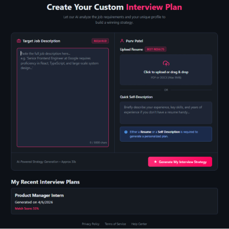
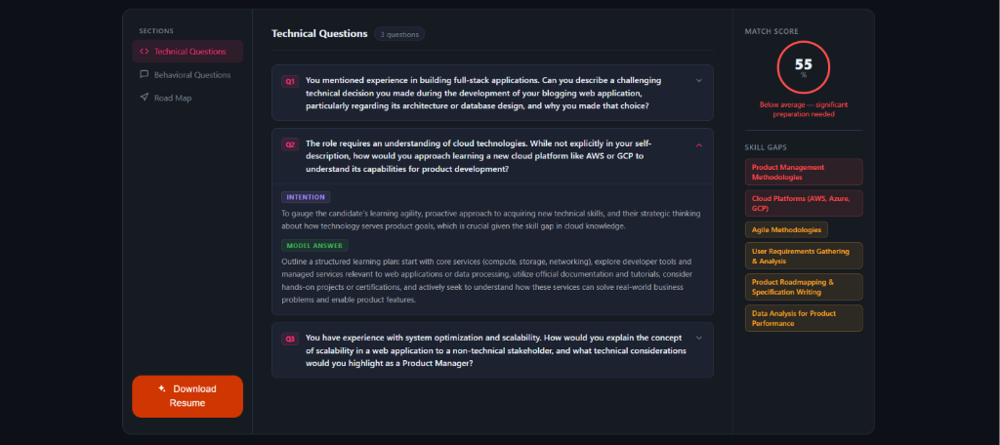
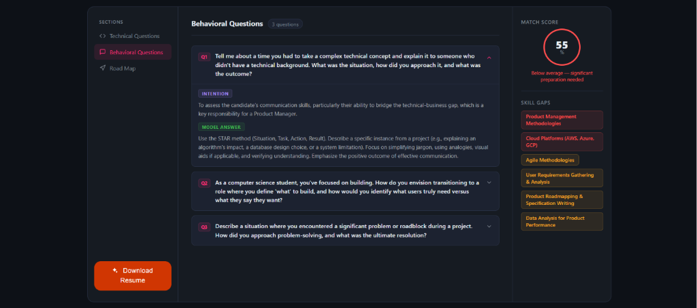
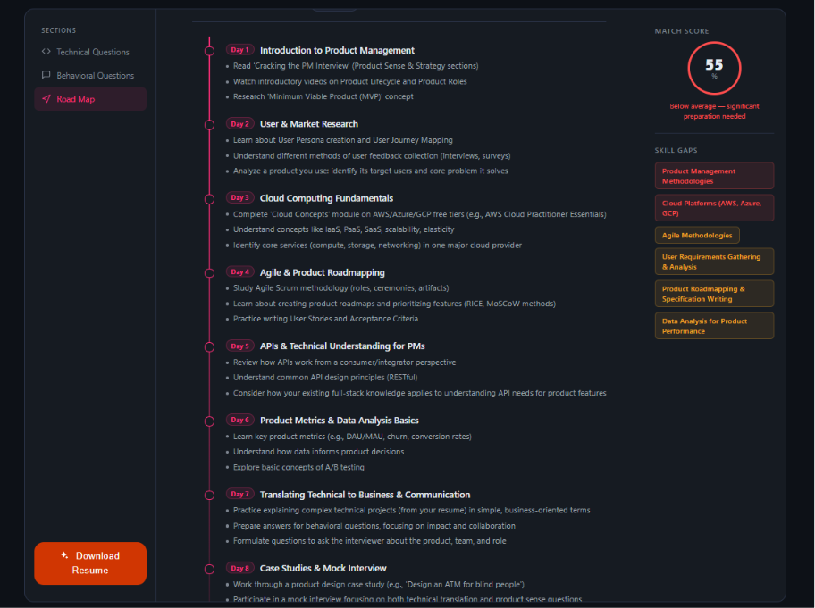

# 🚀 NextRound — AI Interview Preparation & Resume Tailoring Platform


**NextRound** is a full-stack MERN application that helps candidates prepare for interviews with AI-generated, role-specific preparation plans.

It accepts a resume and/or self-description plus a target job description, then generates:
- A **match score**
- **Technical** and **behavioral** interview questions (with intention + answer guidance)
- A **skill-gap analysis**
- A **day-wise preparation roadmap**
- A downloadable **tailored resume PDF**

---

## ✨ Key Features

- 🔐 Email/password authentication with JWT-in-cookie session flow
- 🌐 Google OAuth login with Passport
- 📄 Resume upload (PDF parsing in memory)
- 🤖 AI-generated structured interview report via Gemini API
- 🧭 Sectioned interview workspace (technical, behavioral, roadmap)
- 📊 Match score + skill-gap severity visualization
- 🧾 AI-tailored resume generation and PDF download (Puppeteer)
- 🗂️ Interview history per user

---

## 📸 Screenshots

### Home — Create Interview Plan


### Technical Questions (with Intention & Model Answer)


### Behavioral Questions


### Preparation Road Map — Day-wise Timeline


---

## 🏗️ System Architecture

```text
+----------------------+           +-----------------------+           +-------------------+
| React + Vite Client  |  HTTP     | Express API (Node.js) |  Mongoose  | MongoDB            |
| (Auth + Dashboard +  | <-------> | /api/auth             | <------->  | users, reports,    |
| Interview Workspace) | cookies   | /api/interview        |            | blacklisted tokens |
+----------------------+           +-----------+-----------+           +-------------------+
                                                |
                                                | AI calls
                                                v
                                        +-------------------+
                                        | Google GenAI API  |
                                        | (Gemini 2.5 Flash)|
                                        +-------------------+
                                                |
                                                | HTML -> PDF
                                                v
                                        +-------------------+
                                        | Puppeteer         |
                                        | Resume PDF output |
                                        +-------------------+
```

---

## 🧠 AI Capabilities

### 1) Interview Report Generation
The backend asks Gemini to return strict JSON with:
- `title`
- `matchScore` (0-100)
- `technicalQuestions[]` (question, intention, answer)
- `behaviouralQuestions[]` (question, intention, answer)
- `skillGaps[]` (skill, severity)
- `preparationPlan[]` (day, focus, tasks)

### 2) Resume Tailoring + PDF Export
The backend prompts Gemini to produce ATS-friendly HTML resume content tailored to the selected job description, then renders it to PDF using Puppeteer.

---

## 📁 Project Structure

```bash
NextRound/
├── Backend/
│   ├── server.js
│   ├── package.json
│   └── src/
│       ├── app.js
│       ├── config/
│       ├── controllers/
│       ├── middlewares/
│       ├── models/
│       ├── routes/
│       └── services/
├── frontend/
│   ├── package.json
│   └── src/
│       ├── features/auth/
│       └── features/interview/
└── LICENSE
```

---
## ⚙️ Tech Stack

### Backend
- Node.js + Express 5
- MongoDB + Mongoose
- JWT auth via cookies
- Passport Google OAuth2
- Multer (memory storage) for resume uploads
- `pdf-parse` for resume text extraction
- `@google/genai` for model integration
- Puppeteer for resume PDF generation

### Frontend
- React 19
- React Router 7
- Axios
- Sass/SCSS
- Vite

---

## 🔌 API Overview

### Auth Routes (`/api/auth`)
- `POST /register` — register user
- `POST /login` — login user
- `GET /logout` — logout + blacklist token
- `GET /get-me` — get current user (protected)
- `GET /google` — start OAuth
- `GET /google/callback` — OAuth callback

### Interview Routes (`/api/interview`)
- `POST /` — generate interview report (protected, multipart upload)
- `GET /report/:interviewId` — get a report by id (protected)
- `GET /` — list current user's reports (protected)
- `POST /resume/pdf/:interviewReportId` — generate & download tailored resume PDF (protected)

---

## 🔐 Environment Variables

Create `Backend/.env`:

```env
MONGO_URI=mongodb://localhost:27017/nextround
JWT_SECRET=your_jwt_secret
GOOGLE_GENAI_API_KEY=your_gemini_api_key
GOOGLE_CLIENT_ID=your_google_oauth_client_id
GOOGLE_CLIENT_SECRET=your_google_oauth_client_secret
```

> Current code defaults:
> - Backend runs on `http://localhost:3000`
> - Frontend runs on `http://localhost:5173`
> - CORS and OAuth callback are currently configured for these local URLs.

---

## 🖥️ Local Development Setup

### 1) Clone and enter project
```bash
git clone <your-repo-url>
cd NextRound
```

### 2) Install backend dependencies
```bash
cd Backend
npm install
```

### 3) Install frontend dependencies
```bash
cd ../frontend
npm install
```

### 4) Start backend
```bash
cd ../Backend
npm run dev
```

### 5) Start frontend
```bash
cd ../frontend
npm run dev
```

Open: `http://localhost:5173`

---

## 👤 User Flow
1. Register/Login (or Google sign-in)
2. Paste target job description
3. Upload resume (PDF) and/or add self-description
4. Generate interview strategy
5. Review:
   - Match score
   - Technical questions
   - Behavioral questions
   - Skill gaps
   - Multi-day roadmap
6. Download tailored resume PDF
7. Revisit previous reports from home page

---

## 🧪 Suggested Improvements (Roadmap)

- Add centralized request validation (e.g., Zod on all input payloads)
- Add robust error boundaries + toast notifications on frontend
- Externalize all base URLs to environment configs
- Add Docker setup for one-command local boot
- Add test coverage (unit + integration + e2e)
- Add rate limiting and security headers (helmet, throttling)
- Add background job queue for heavy PDF generation

---

## 📜 License

This project is licensed under the **MIT License**. See `LICENSE` for details.